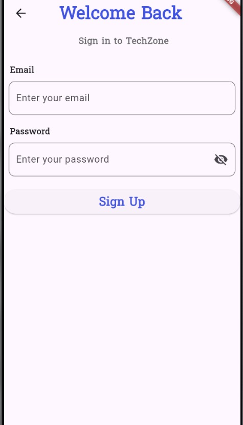
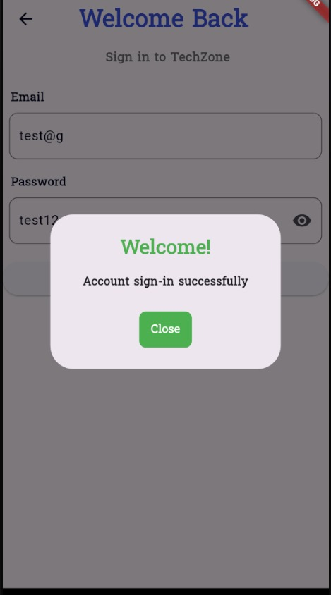
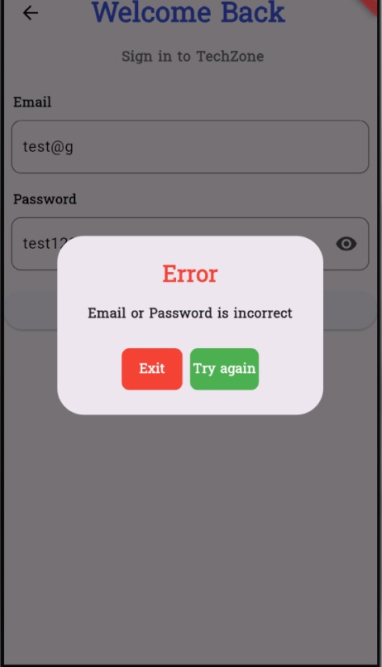
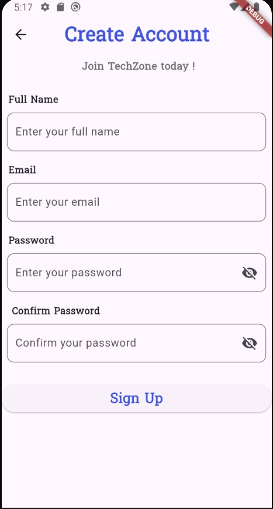
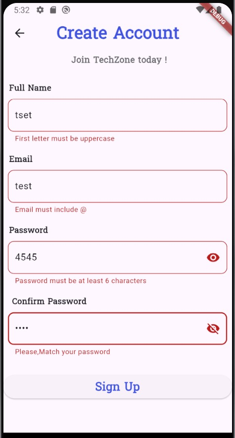
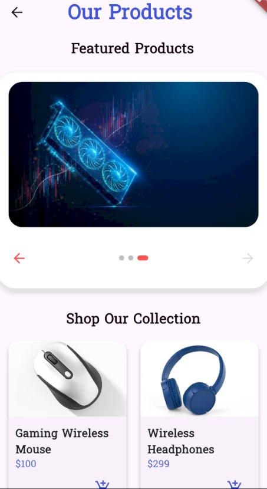
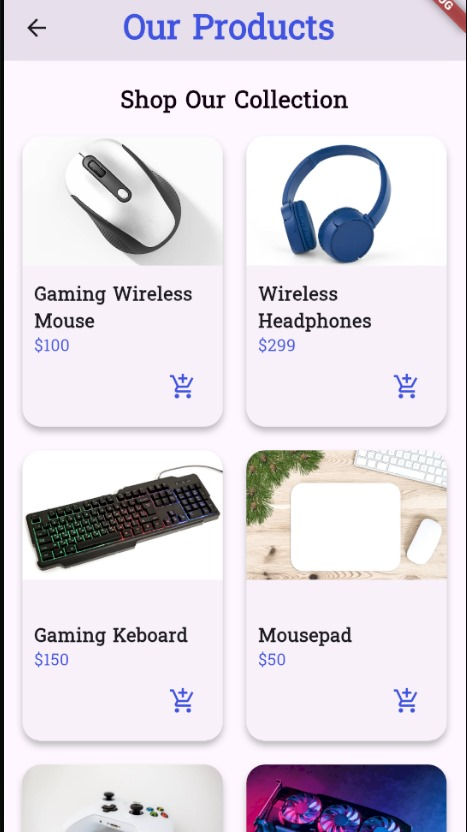
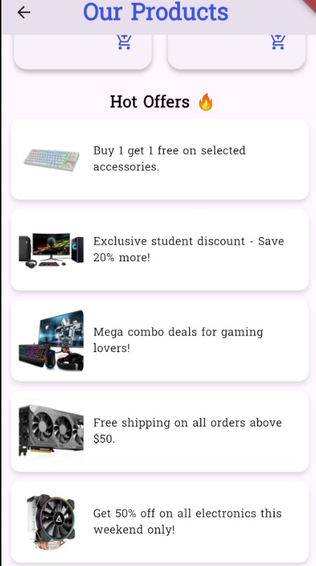
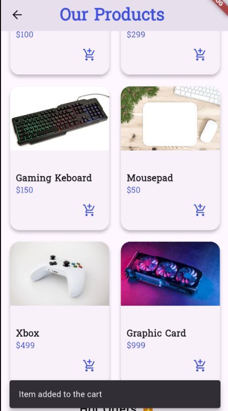

# 🛍️ TechZone - Shopping App

## 📌 Project Overview

**TechZone** is a modern shopping mobile application built with Flutter.  
The app focuses on a smooth and attractive user experience, allowing users to browse products, view featured offers, and manage their shopping experience with ease.

---

## 🚀 Features

- 👤 **User Authentication**  
  Users can register a new account or sign in using their credentials.

- 👋 **Welcome Screen**  
  A sleek introduction screen that welcomes the user to the app.

- 🛒 **Product Cards**  
  Each product is displayed inside a styled card showing its image, name, and price.

- 💫 **Featured Items Section**  
  A horizontal slider showcasing special offers and highlighted products.

- 🎞️ **Smooth Page Transitions**  
  Uses fade animations between screens for a polished look.

- 🔤 **Custom Fonts**  
  The UI is styled using elegant custom fonts for a unique brand identity.

---

## 🛠️ Setup Instructions

```bash
flutter pub get
flutter run

## 📸 Screenshots

### 🟢 Welcome Screen


### 🔐 Sign In Screens




### 📝 Sign Up Screens




### 🏠 Home Screens




